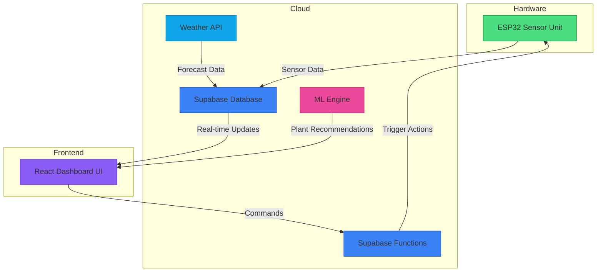

# GardenCare System Documentation

## 🌿 Overview

GardenCare is a comprehensive IoT system for smart plant monitoring and automated irrigation. It integrates hardware sensors (ESP32), a cloud backend (Supabase), and a web dashboard (React) to provide real-time monitoring and intelligent plant care.

## 🏗️ System Architecture

### Architecture Diagram



### Component Descriptions

#### ESP32 Sensor Unit
The hardware component responsible for collecting environmental data:
- **DHT11 Sensor**: Measures temperature and humidity
- **Soil Moisture Sensor**: Monitors soil hydration levels
- **Light Sensor**: Detects ambient light conditions
- **Water Pump Control**: Controls irrigation via ULN2002 transistor driver
- **WiFi Connectivity**: Communicates with Supabase backend

#### Supabase Backend
The cloud infrastructure providing data storage, authentication, and business logic:
- **PostgreSQL Database**: Stores sensor data, user profiles, and system configuration
- **Authentication**: Secure user login and registration
- **Realtime Engine**: WebSocket connections for live data updates
- **Edge Functions**: Serverless functions for processing commands
- **RESTful API**: HTTP interface for data access

#### React Dashboard
The web-based user interface for monitoring and control:
- **Real-time Charts**: Visualize sensor data trends
- **Plant Recommendations**: AI-powered plant suggestions
- **Watering Controls**: Manual and automated irrigation management
- **Alert System**: Notifications for critical conditions
- **Zone Management**: Configure multiple garden areas

#### Weather Integration
External service providing environmental context:
- **Weather API**: Current conditions and forecasts
- **Data Enrichment**: Enhanced plant care recommendations

#### Machine Learning Engine
Intelligent plant recommendation system:
- **Environmental Analysis**: Matches conditions to optimal plants
- **Care Guidelines**: Provides detailed plant care information

## 📊 Data Tables and Relationships

For detailed information about the backend architecture, see [Backend Architecture Documentation](Docs/BACKEND_ARCHITECTURE.md).

For comprehensive API documentation, see [Backend API Documentation](Docs/BACKEND_API.md).

For security implementation details, see [Backend Security Documentation](Docs/BACKEND_SECURITY.md).

For ESP32 integration specifics, see [ESP32 Integration Documentation](Docs/ESP32_INTEGRATION.md).

### Core Tables

#### zones
Stores information about garden areas:
- `id` (UUID) - Primary key
- `name` (TEXT) - Zone identifier
- `description` (TEXT) - Zone details
- `soil_type` (TEXT) - Type of soil in zone
- `moisture_threshold` (DECIMAL) - Target moisture level
- `pump_on` (BOOLEAN) - Pump activation status
- `user_id` (UUID) - Foreign key to users
- `created_at` (TIMESTAMP) - Record creation time
- `updated_at` (TIMESTAMP) - Last update time

#### devices
Represents ESP32 hardware units:
- `id` (UUID) - Primary key
- `name` (TEXT) - Device name
- `device_id` (TEXT) - String identifier
- `device_type` (TEXT) - Device category (default: esp32)
- `status` (TEXT) - Current status (online/offline/error)
- `last_seen` (TIMESTAMP) - Last communication time
- `ip_address` (INET) - Device IP address
- `mac_address` (TEXT) - Device MAC address
- `firmware_version` (TEXT) - Current firmware version
- `zone_id` (UUID) - Foreign key to zones
- `user_id` (UUID) - Foreign key to users
- `created_at` (TIMESTAMP) - Record creation time
- `updated_at` (TIMESTAMP) - Last update time

#### sensor_data
Environmental readings from devices:
- `id` (UUID) - Primary key
- `device_id` (UUID) - Foreign key to devices
- `zone_id` (UUID) - Foreign key to zones
- `temperature` (DECIMAL) - Temperature in Celsius
- `humidity` (DECIMAL) - Relative humidity percentage
- `soil_moisture` (DECIMAL) - Soil moisture percentage
- `light_level` (INTEGER) - Light intensity reading
- `ph_level` (DECIMAL) - Soil pH level
- `battery_level` (DECIMAL) - Device battery percentage
- `timestamp` (TIMESTAMP) - Reading timestamp
- `user_id` (UUID) - Foreign key to users

#### watering_controls
Irrigation system configuration:
- `id` (UUID) - Primary key
- `zone_id` (UUID) - Foreign key to zones
- `device_id` (UUID) - Foreign key to devices
- `pump_pin` (INTEGER) - GPIO pin for pump control
- `valve_pin` (INTEGER) - GPIO pin for valve control
- `is_active` (BOOLEAN) - System activation status
- `auto_mode` (BOOLEAN) - Automatic watering mode
- `moisture_threshold` (DECIMAL) - Trigger threshold
- `watering_duration` (INTEGER) - Duration in seconds
- `last_watered` (TIMESTAMP) - Last watering time
- `next_scheduled_watering` (TIMESTAMP) - Next scheduled time
- `user_id` (UUID) - Foreign key to users
- `created_at` (TIMESTAMP) - Record creation time
- `updated_at` (TIMESTAMP) - Last update time

#### watering_schedules
Automated watering routines:
- `id` (UUID) - Primary key
- `zone_id` (UUID) - Foreign key to zones
- `name` (TEXT) - Schedule name
- `cron_expression` (TEXT) - Timing pattern
- `duration` (INTEGER) - Watering duration in seconds
- `is_active` (BOOLEAN) - Schedule activation status
- `last_executed` (TIMESTAMP) - Last execution time
- `next_execution` (TIMESTAMP) - Next execution time
- `user_id` (UUID) - Foreign key to users
- `created_at` (TIMESTAMP) - Record creation time
- `updated_at` (TIMESTAMP) - Last update time

#### commands
Actions sent to devices:
- `id` (UUID) - Primary key
- `device_id` (UUID) - Foreign key to devices
- `command_type` (TEXT) - Type of command
- `parameters` (JSONB) - Command parameters
- `status` (TEXT) - Execution status
- `priority` (INTEGER) - Command priority
- `retry_count` (INTEGER) - Number of retries
- `max_retries` (INTEGER) - Maximum retry attempts
- `last_retry_at` (TIMESTAMP) - Last retry time
- `error_message` (TEXT) - Error details
- `result` (JSONB) - Execution result
- `executed_at` (TIMESTAMP) - Execution completion time
- `expires_at` (TIMESTAMP) - Expiration time
- `user_id` (UUID) - Foreign key to users
- `created_at` (TIMESTAMP) - Record creation time
- `updated_at` (TIMESTAMP) - Last update time

#### alerts
System notifications:
- `id` (UUID) - Primary key
- `type` (TEXT) - Alert category
- `zone` (TEXT) - Related zone
- `message` (TEXT) - Alert description
- `severity` (TEXT) - Alert priority
- `is_read` (BOOLEAN) - Read status
- `is_acknowledged` (BOOLEAN) - Acknowledgment status
- `data` (JSONB) - Additional data
- `user_id` (UUID) - Foreign key to users
- `timestamp` (TIMESTAMP) - Alert creation time
- `expires_at` (TIMESTAMP) - Expiration time

## 🔁 System Flow

### 1. Sensor Data Collection
1. ESP32 device reads sensors (temperature, humidity, soil moisture, light)
2. Data is formatted and sent to Supabase via HTTP POST
3. Supabase stores data in `sensor_data` table
4. Database triggers process new readings for alerts and automation

### 2. Real-time Dashboard Updates
1. React dashboard subscribes to Supabase real-time channels
2. New sensor data automatically updates charts and statistics
3. Alert notifications appear in real-time
4. Device status changes are reflected immediately

### 3. Automated Watering Process
1. Database trigger evaluates new sensor readings
2. If soil moisture is below threshold, create watering command
3. ESP32 periodically checks for pending commands
4. Command is executed to activate water pump
5. Pump runs for specified duration
6. Completion status is reported back to Supabase

### 4. Manual Control
1. User interacts with dashboard controls
2. Commands are sent to Supabase `commands` table
3. ESP32 retrieves and executes commands
4. Results are reported back to dashboard

### 5. Plant Recommendations
1. Dashboard analyzes current environmental conditions
2. ML engine matches conditions to suitable plants
3. Recommendations are displayed with care instructions
4. Users can view detailed plant information

## 🚀 Future Enhancements

### Mobile Application
- Native iOS and Android apps for garden monitoring
- Push notifications for critical alerts
- Offline data synchronization
- Camera integration for plant health analysis

### Advanced ML Models
- Plant disease detection using image recognition
- Predictive analytics for optimal watering schedules
- Yield prediction for edible plants
- Personalized plant care recommendations

### Enhanced Hardware
- Solar-powered sensor nodes
- LoRaWAN connectivity for large gardens
- Multi-sensor integration (pH, nutrient levels)
- Advanced irrigation systems (drip, sprinkler)

### Community Features
- Plant sharing and trading platform
- Community gardening projects
- Expert advice and Q&A forum
- Seasonal planting guides

## 🔧 Development Guidelines

### Code Structure
```
src/
├── components/          # React UI components
├── contexts/            # React context providers
├── data/                # Static data files
├── lib/                 # Utility libraries
├── pages/               # Page components
├── services/            # Business logic services
├── test/                # Test files
└── utils/               # Helper functions
```

### Database Design Principles
- All tables implement Row Level Security
- Foreign key relationships ensure data integrity
- Indexes optimize query performance
- Views simplify complex data access
- Functions encapsulate business logic

### Security Best Practices
- Authentication tokens are never exposed in client code
- API keys are stored securely with limited permissions
- Data encryption for sensitive information
- Regular security audits and updates

---

*GardenCare Documentation - Last Updated: October 6, 2025*