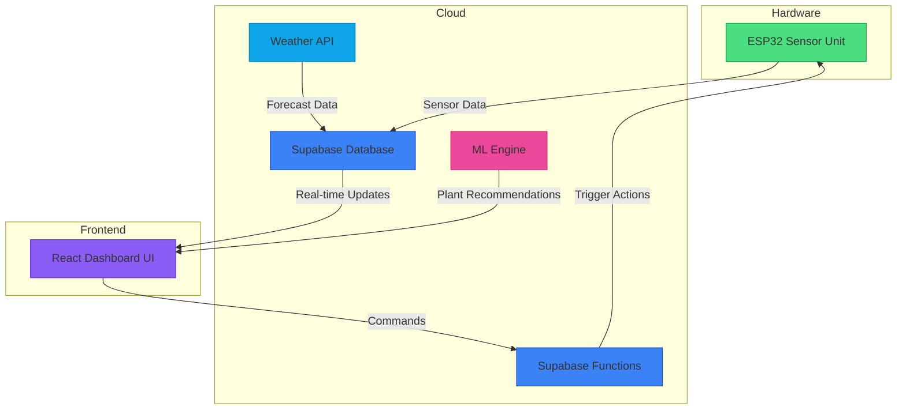

# GardenCare Dashboard

A comprehensive IoT dashboard for smart plant monitoring and automated irrigation systems.

## 🌱 Overview

GardenCare is a full-stack IoT solution that enables users to monitor and control their garden environment through a web-based dashboard. The system integrates ESP32 microcontrollers with various sensors to collect environmental data and automate watering based on plant needs.

## 🏗️ System Architecture



## 🚀 Features

- **Real-time Monitoring**: Live sensor data visualization
- **Automated Watering**: Smart irrigation based on soil moisture
- **Plant Recommendations**: AI-powered plant suggestions
- **Alert System**: Notifications for critical conditions
- **Zone Management**: Configure multiple garden areas
- **Historical Data**: Trend analysis and reporting
- **Mobile Responsive**: Works on all device sizes

## 📁 Project Structure

```
.
├── Docs                    # Documentation files
│   ├── code-snippets       # Detailed code explanations
│   ├── BACKEND_ARCHITECTURE.md    # Backend architecture documentation
│   ├── BACKEND_API.md             # Backend API documentation
│   ├── BACKEND_SECURITY.md        # Backend security documentation
│   ├── ESP32_INTEGRATION.md       # ESP32 integration documentation
│   ├── BACKEND_SUMMARY.md         # Backend summary documentation
│   ├── BACKEND_OVERVIEW.md        # Backend overview documentation
│   ├── API_REFERENCE.md    # API reference
│   ├── CHANGELOG.md        # Project changelog
│   ├── SETUP_GUIDE.md      # Setup instructions
│   └── TROUBLESHOOTING.md  # Troubleshooting guide
├── assets                  # Static assets
├── src                     # Source code
│   ├── components          # React components
│   ├── contexts            # React contexts
│   ├── data                # Static data files
│   ├── hooks               # Custom React hooks
│   ├── lib                 # Utility libraries
│   ├── pages               # Page components
│   ├── services            # Business logic services
│   ├── test                # Test files
│   ├── utils               # Helper functions
│   ├── App.jsx             # Main application component
│   ├── index.css           # Global styles
│   └── main.jsx            # Application entry point
├── supabase                # Supabase configuration
│   ├── functions           # Edge Functions
│   ├── migrations          # Database migrations
│   └── README.md           # Supabase setup instructions
├── DOCUMENTATION.md        # Main project documentation
├── README.md               # Project overview
├── eslint.config.js        # ESLint configuration
├── index.html              # HTML entry point
├── package.json            # Project dependencies
├── postcss.config.js       # PostCSS configuration
├── tailwind.config.js      # Tailwind CSS configuration
├── vercel.json             # Vercel deployment configuration
└── vitest.config.js        # Vitest testing configuration
```

## 🛠️ Tech Stack

### Frontend
- **React 18** - UI library
- **Vite** - Build tool
- **Tailwind CSS** - Styling framework
- **React Router** - Client-side routing
- **Supabase JS Client** - Backend integration
- **Chart.js** - Data visualization
- **Framer Motion** - Animations

### Backend
- **Supabase** - Backend-as-a-Service
  - **PostgreSQL** - Database
  - **Supabase Auth** - Authentication
  - **Realtime Engine** - WebSocket connections
  - **Edge Functions** - Serverless functions
  - **Storage** - File storage

### Hardware
- **ESP32** - Microcontroller
- **DHT11** - Temperature/Humidity sensor
- **Soil Moisture Sensor** - Soil hydration monitoring
- **Light Sensor** - Ambient light detection
- **Water Pump** - Irrigation system
- **ULN2003 Driver** - Pump control

## 📖 Documentation

For detailed information about the project, please refer to the following documentation files:

- [Main Documentation](DOCUMENTATION.md) - Complete project overview
- [Backend Architecture](Docs/BACKEND_ARCHITECTURE.md) - Database schema and security implementation
- [Backend API](Docs/BACKEND_API.md) - API endpoints and Edge Functions
- [Backend Security](Docs/BACKEND_SECURITY.md) - Security measures and compliance
- [ESP32 Integration](Docs/ESP32_INTEGRATION.md) - Device communication protocols
- [Backend Summary](Docs/BACKEND_SUMMARY.md) - Executive summary of backend features
- [Backend Overview](Docs/BACKEND_OVERVIEW.md) - High-level backend architecture
- [API Reference](Docs/API_REFERENCE.md) - REST API documentation
- [Setup Guide](Docs/SETUP_GUIDE.md) - Installation and configuration instructions
- [Troubleshooting](Docs/TROUBLESHOOTING.md) - Common issues and solutions

## 🚀 Getting Started

### Prerequisites
- Node.js 16+
- npm or yarn
- Supabase account
- ESP32 development board (for hardware integration)

### Installation

1. Clone the repository:
```bash
git clone https://github.com/your-username/garden-care-dashboard.git
cd garden-care-dashboard
```

2. Install dependencies:
```bash
npm install
```

3. Set up environment variables:
```bash
cp .env.example .env
# Edit .env with your Supabase credentials
```

4. Start the development server:
```bash
npm run dev
```

### Supabase Setup

1. Create a new Supabase project
2. Run the database migrations from `supabase/migrations/`
3. Deploy the Edge Functions from `supabase/functions/`
4. Configure authentication settings
5. Set up storage buckets

## 🧪 Testing

Run the test suite:
```bash
npm run test
```

Run tests in watch mode:
```bash
npm run test:watch
```

## 📦 Deployment

### Vercel Deployment

1. Connect your GitHub repository to Vercel
2. Set environment variables in Vercel dashboard
3. Deploy!

### Manual Deployment

Build the project:
```bash
npm run build
```

Serve the built files:
```bash
npm run preview
```

## 🤝 Contributing

1. Fork the repository
2. Create a feature branch
3. Commit your changes
4. Push to the branch
5. Create a pull request

## 📄 License

This project is licensed under the MIT License - see the [LICENSE](LICENSE) file for details.

## 🙏 Acknowledgments

- [Supabase](https://supabase.io) for the amazing backend platform
- [React](https://reactjs.org) for the UI library
- [Tailwind CSS](https://tailwindcss.com) for the styling framework
- All the open-source libraries that made this project possible

---
*GardenCare Dashboard - Last Updated: October 6, 2025*